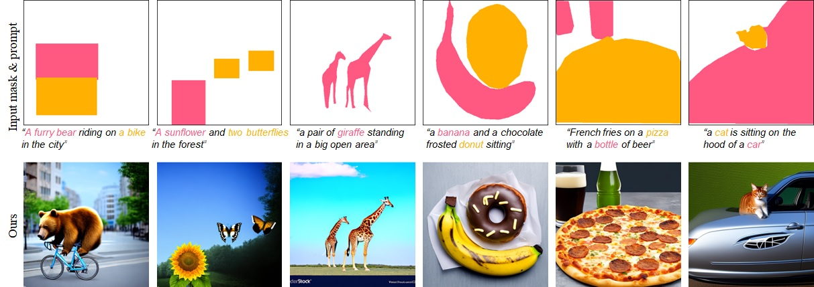

# User-Controllable Latent Transformer for StyleGAN Image Layout Editing
  <a href="https://arxiv.org/abs/2308.06027"></a>
  <a href="https://opensource.org/licenses/MIT"></a>
<p align="center">

</p>

This repository contains our implementation of the following paper:

Yuki Endo: "Masked-Attention Diffusion Guidance for Spatially Controlling Text-to-Image Generation," accepted to The Visual Computer Journal.  [[Project](http://www.cgg.cs.tsukuba.ac.jp/~endo/projects/UserControllableLT)] [[PDF (preprint)](https://arxiv.org/abs/2308.06027)]

## Prerequisites  
1. Python3
2. PyTorch
3. Others (see env.yml)

## Preparation
Download the Stable Diffusion model weight (512-base-ema.ckpt) from [https://huggingface.co/stabilityai/stable-diffusion-2-base](https://huggingface.co/stabilityai/stable-diffusion-2-base) and put it in the checkpoint directory. 

## Inference
You can generate an image from an input mask and prompt by running the following command:
```
python scripts/txt2img_mag.py --ckpt ./checkpoint/512-base-ema.ckpt --prompt "A furry bear riding on a bike in the city" --mask ./inputs/mask1.png --word_ids_for_mask "[[1,2,3,4],[6,7]]" --outdir ./outputs
```
Here, "word_ids_for_mask" means word indices corresponding to each region in a mask image. For example, if you specify word_ids_for_mask as "[[1,2,3,4],[6,7]]", the first region corresponds to "A" (1), "furry" (2), "bear" (3), and "riding" (4), and the second region corresponds to "a" (6) and "bike" (7). (An index 0 means the token of the beginning of the sentence.) The order of regions is determined as a reverse order based on BGR color.

## Citation
Please cite our paper if you find the code useful:
```
@Article{endoTVC2023,
Title = {Masked-Attention Diffusion Guidance for Spatially Controlling Text-to-Image Generation},
Author = {Yuki Endo},
Journal = {The Visual Computer},
volume = {},
number = {},
pages = {},
doi = {},
Year = {2023}
}
```

## Acknowledgements
This code heavily borrows from the [Stable Diffusion](https://github.com/Stability-AI/stablediffusion) repository. 
